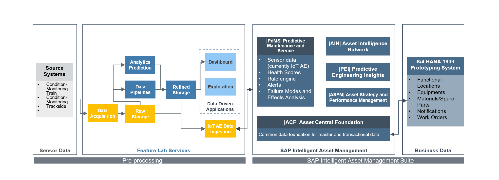

# Railway Batch data “Pre-Processing Unit” with SAP PdMS

Modern railway vehicles collect a vast amount of data. The vehicle typically collects the data and sends batch files over the central bus to a central system. There is a reason for this. Railway companies are only processing a small subset of the sensor data in real-time. Software systems as the PdMS from SAP expect data in a streaming format. Those systems cannot process batch files.  

The snippets in this repository can be used as a starting point to connect batch data to a SAP PdMS instance.



## Wrapping the Requests

SAP provides an SDK to communicate with the SAP IoT Application Enablement (https://github.com/SAP/iot-application-services-sdk-nodejs). The SDK is built to receive sensor data for equipment to be consumed in SAP PdMS. At the time of writing, the services behind the SDK are not able to handle the request load of a batch file.

```javascript
require('dotenv').config();
const ApplicationServicesSDK = require('iot-application-services-sdk-nodejs');

class DataIngestion {
    constructor() {
        this._oIoTSDK = new ApplicationServicesSDK();
        this._oIoTSDK.setBaseUrl('appiot-mds');
        this._oAssetCentralSDK = new ApplicationServicesSDK();
        this._oAssetCentralSDK.setBaseUrl('ac', false);
        this._aIndicatorsToProcess = [];
        this._aEquipments = {};
        this._dRetentionPeriodStart = null;
    }
    async getEquipment(sEquipmentID) {
        if (this._aEquipments[sEquipmentID]) {
            return this._aEquipments[sEquipmentID];
        } else {
            try {
                let oResponse = await this._oAssetCentralSDK.request({
                    url: '/services/api/v1/equipment(' + sEquipmentID + ')/components',
                    method: 'GET'
                });
                let aAttributes = await this._oAssetCentralSDK.request({
                    url: '/services/api/v1/equipment(' + oResponse.id + ')/values?status=' + oResponse.status,
                    method: 'GET'
                });
                let aMountingPosition = this._getObjects(aAttributes, "attributeId", process.env.MOUNTINGPOSITION);
                if (aMountingPosition.length === 1) oResponse.mountingPosition = aMountingPosition[0].value1;
                for (let i = 0; i < oResponse.childNodes.length; i++) {
                    if (oResponse.childNodes[i].status !== 0) {
                        aAttributes = await this._oAssetCentralSDK.request({
                            url: '/services/api/v1/equipment(' + oResponse.childNodes[i].id + ')/values?status=' + oResponse.childNodes[i].status,
                            method: 'GET'
                        });
                        //add the mounting position if available
                        aMountingPosition = this._getObjects(aAttributes, "attributeId", process.env.MOUNTINGPOSITION);
                        if (aMountingPosition.length === 1) oResponse.childNodes[i].mountingPosition = aMountingPosition[0].value1;
                    }
                }
                try {
                    // find pdmsSysThing mapping in externalIDs
                    oResponse.externalIDs = await this._oAssetCentralSDK.request({
                        url: '/services/api/v1/objectid/externalid(' + sEquipmentID + ')',
                        method: 'GET'
                    });
                    oResponse.externalIDs = oResponse.externalIDs.find(oExternalID => {
                        return oExternalID.systemName === 'pdmsSysThing';
                    });
                    // get thing id from external ids
                    if (!!oResponse.externalIDs.externalID) oResponse.thingID = oResponse.externalIDs.externalID;
                } catch (oError) {
                    console.log("External ID of equipment " + sEquipmentID + " not found");
                }
                // add equipment to equipments array...
                this._aEquipments[sEquipmentID] = oResponse;
                return oResponse;
            } catch (oError) {
                console.log("Error reading equipment from asset central: " + JSON.stringify(oError));
            }
        }
    }
    async getEquipmentByFilter(sFilter, sFilterValue) {
        try {
            return await this._oAssetCentralSDK.request({
                url: "/services/api/v1/equipment?$filter=(" + sFilter + " eq '" + sFilterValue + "')",
                method: 'GET'
            });
        } catch (oError) {
            console.log("Error reading equipment with filter: " + sFilter + " value: " + sFilterValue + " from asset central: " + JSON.stringify(oError));
        }
    }
    async preprocessIndicatorValues(sThingID, oPropertySet) {
        //preprocessIndicatorValues indicator values 
        for (const sKey of Object.keys(oPropertySet)) {
            //adding indicators for processing
            await this.addIndicatorForProcessing(sThingID, sKey, this._typeConversion(oPropertySet[sKey]));
        }
    }
    async getThingType(sThingID) {
        try {
            //get thing details
            let oResponse = await this._oIoTSDK.request({
                url: "/Things('" + sThingID + "')",
                method: 'GET'
            });
            return !!oResponse._thingType && oResponse._thingType.length > 0 ? oResponse._thingType[0] : null;
        } catch (oError) {
            console.log("Error reading thing properties: " + JSON.stringify(oError));
            return null;
        }
    }
    async addIndicatorForProcessing(sThingID, sIndicatorGroup, oIndicatorValue) {
        let oIndicatorGroup = this._aIndicatorsToProcess.find(oIndicator => oIndicator.ThingID === sThingID && oIndicator.IndicatorGroup === sIndicatorGroup);
        if (!oIndicatorGroup) {
            let sThingType = await this.getThingType(sThingID);
            //creation of a new indicator
            oIndicatorGroup = {
                ThingID: sThingID,
                ThingType: sThingType,
                IndicatorGroup: sIndicatorGroup,
                IndicatorValues: []
            };
            //adding new indicator group
            this._aIndicatorsToProcess.push(oIndicatorGroup);
        }
        //delete initial/python NULL values from oIndicatorValue
        for (let sProperty in oIndicatorValue) {
            if (oIndicatorValue[sProperty] === null || oIndicatorValue[sProperty] === undefined || oIndicatorValue[sProperty] === 'NULL' || oIndicatorValue[sProperty] === '') {
                delete oIndicatorValue[sProperty];
            }
        }
        //add indicator values if values are not yet available
        if (oIndicatorGroup.ThingType !== null) {
            let oExistingIndicator = oIndicatorGroup.IndicatorValues.find(oPreprocessedIndicatorValue => oPreprocessedIndicatorValue._time === oIndicatorValue._time);
            if (!oExistingIndicator) oIndicatorGroup.IndicatorValues.push(oIndicatorValue);
            else oExistingIndicator = Object.assign(oExistingIndicator, oIndicatorValue);
        }
    }
    async processIndicatorValues() {
        while (this._aIndicatorsToProcess.length > 0) {
            let oIndicatorToProcess = this._aIndicatorsToProcess.shift();
            await this.putIndicatorValues(oIndicatorToProcess.ThingID, oIndicatorToProcess.ThingType, oIndicatorToProcess.IndicatorGroup, oIndicatorToProcess.IndicatorValues);
        }
    }
    async putIndicatorValues(sThingID, sThingType, sIndicatorGroup, aIndicatorValues) {
        try {
            this._dRetentionPeriodStart = this._dRetentionPeriodStart === null ? new Date(new Date().setDate(new Date().getDate() - await this._getRetentionPeriodInDays())) : this._dRetentionPeriodStart;
            let oRequest = {
                url: "/Things('" + sThingID + "')/" + sThingType + "/" + sIndicatorGroup,
                method: 'PUT',
                body: { value: aIndicatorValues.filter(oPropertyValue => { return new Date(oPropertyValue._time) > this._dRetentionPeriodStart; }) }
            };
            //put dat data to the sky..
            if (oRequest.body.value.length > 0) {
                //console.log("put indicator values "+ JSON.stringify(oRequest));
                await this._oIoTSDK.request(oRequest);
            }
        } catch (oError) { console.log("Error while adding indicator values: " + JSON.stringify(oError)); }
    }
    _getObjects(oObject, sKey, sValue) {
        let aObjects = [];
        for (let i in oObject) {
            if (!oObject.hasOwnProperty(i)) continue;
            if (typeof oObject[i] == 'object') {
                aObjects = aObjects.concat(this._getObjects(oObject[i], sKey, sValue));
            } else if (i == sKey && oObject[sKey] == sValue) {
                aObjects.push(oObject);
            }
        }
        return aObjects;
    }
    _typeConversion(oObject) {
        for (const sKey of Object.keys(oObject)) {
            if (/^I_/.test(sKey)) oObject[sKey] = /(True)/.test(oObject[sKey]) ? true : /(False)/.test(oObject[sKey]) ? false : !isNaN(parseFloat(oObject[sKey])) ? parseFloat(oObject[sKey]) : oObject[sKey];
        }
        return oObject;
    }
    async _getRetentionPeriodInDays() {
        try {
            let oRetentionPeriodResponse = await this._oIoTSDK.request({ url: "/TimeseriesRetentionPeriod", method: 'GET' });
            return oRetentionPeriodResponse._retentionPeriodInDays;
        }
        catch (oError) {
            console.log("Error while reading retention period in days: " + JSON.stringify(oError));
        }
    }
}
// Exports
module.exports = DataIngestion;
```

## Sending the data

Single entries in the batch file have to be sent individually. Each entry will be attached to equipment in SAP PdMS. A linking of the identifier from the batch file to the equipment is therefore necessary. The script achieves this by looking up the equipment before sending the data.

```javascript
async function preprocessRawObect(aRawObjects) {
    for (let i = 0; i < aVehicleMapping.length; i++) {
        //assign RawObjects to Vehicles
        aVehicleMapping[i].aRawObjects = aRawObjects.filter(oRawObject => oRawObject.VehicleID === aVehicleMapping[i].VehicleID); try {
            let oResponse = await oDataIngestion.getEquipment(aVehicleMapping[i].EquipmentID);
            if (!!oResponse.thingID) {
                for (let j = 0; j < aVehicleMapping[i].aRawObjects.length; j++) {
                    let oRawObject = aVehicleMapping[i].aRawObjects[j];
                    let sTimeStamp = !oRawObject.EndDate ? new Date(oRawObject.StartDate).toISOString() : new Date(oRawObject.EndDate).toISOString();
                    await preprocessRawObectRecursive(oDataIngestion, oResponse, sTimeStamp, oRawObject);
                }
            }
        } catch (oError) {
            console.log("Error JSON to PUSH structure mapping: " + JSON.stringify(oError));
        }
    }
}
```

```javascript
async function preprocessRawObectRecursive(oDataIngestion, oEquipment, sTimeStamp, oRawObject) {
    //recursive evaluation of equipmennts and subordinate equipments concerning relevant mounting positions
    if (!!oEquipment.thingID && !!oRawObject.propertySets) {
        for (const sKey of Object.keys(oRawObject.propertySets)) {
            oRawObject.propertySets[sKey]._time = sTimeStamp;
        }
        await oDataIngestion.preprocessIndicatorValues(oEquipment.thingID, oRawObject.propertySets);
    }
    if (!!oRawObject.mountingPositions) {
        for (const sKey of Object.keys(oRawObject.mountingPositions)) {
            let oSubEquipment = oEquipment.childNodes.find(oChildNode => {
                return oChildNode.mountingPosition === sKey;
            });
            //reading subordinate equipments recursive
            if (!!oEquipment && !!oEquipment.id) await preprocessRawObectRecursive(oDataIngestion, await oDataIngestion.getEquipment(oSubEquipment.id), sTimeStamp, oRawObject.mountingPositions[sKey]);
        }
    }
}
```

## Disclaimer

THE SCRIPTS ARE PROVIDED AS IS WITHOUT WARRANTY OF ANY KIND, EITHER EXPRESS OR IMPLIED, INCLUDING ANY IMPLIED WARRANTIES OF FITNESS FOR A PARTICULAR PURPOSE, MERCHANTABILITY, OR NON-INFRINGEMENT. THIS SOFTWARE IS NOT OFFICIALLY ENDORSED OR SUPPORTED BY SAP.

## License

Apache License Version 2.0 [LICENSE](LICENSE)
